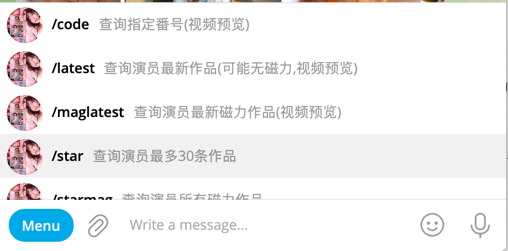
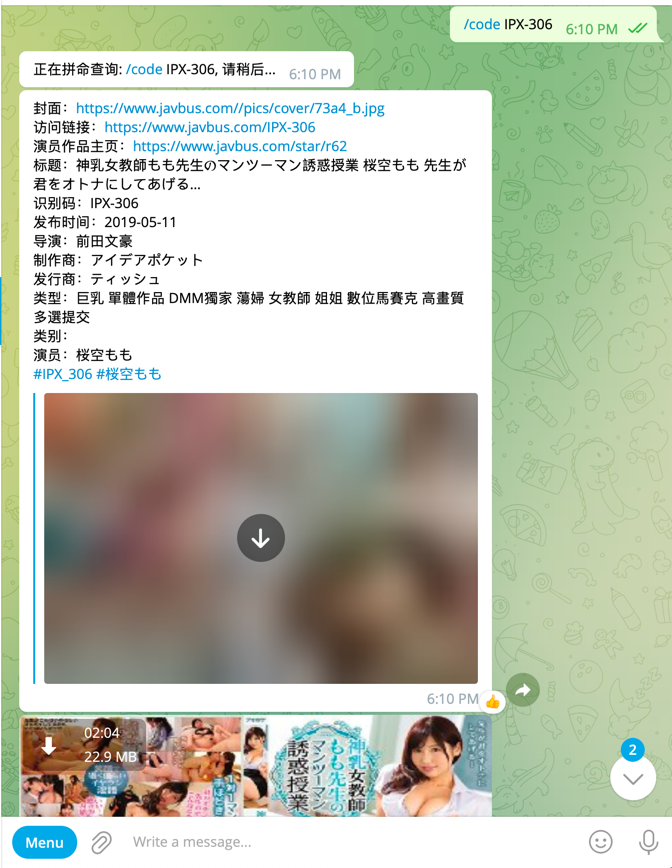
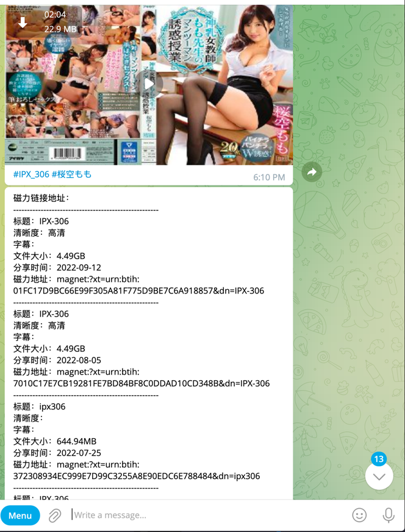
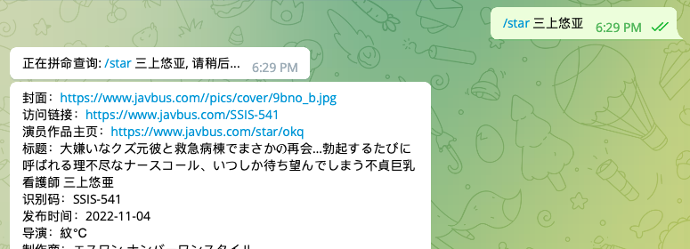
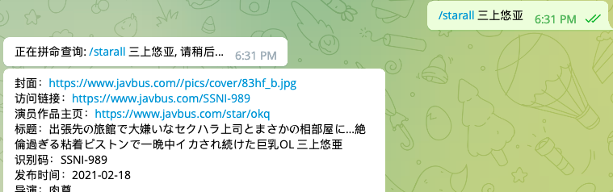
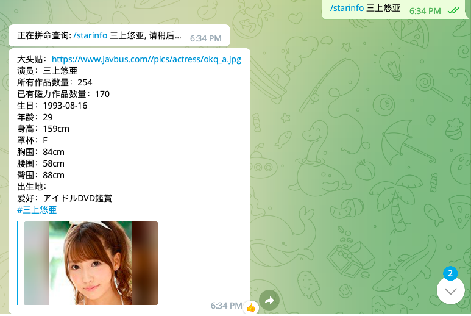
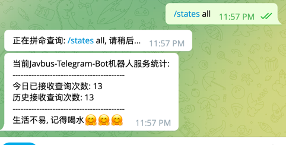
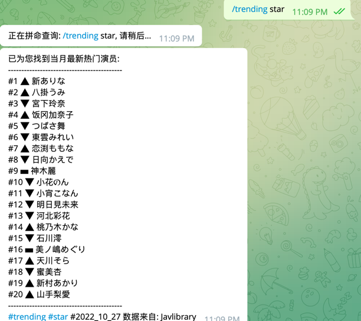
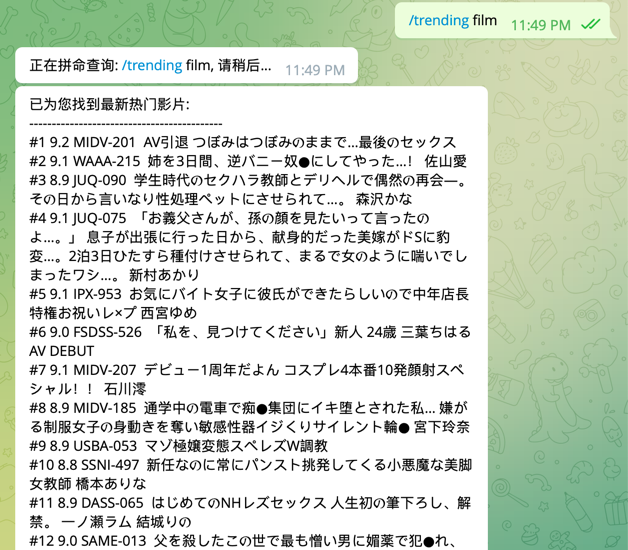

### telegram bot for javbus

部署一个Javbus Film 搜索机器人, 柯学涩涩。

运行环境:

```bash
JDK 1.8
```

远程使用说明：

```bash
1. 找个国外的主机
2. git clone https://github.com/fireinrain/javbus-telegram-bot.git
3. cd 到仓库目录, 执行 `mvn clean && mvn package`
4. cd target
5. 将javbus-tg-bot-jar-with-dependencies.jar包上传到远程机器
6. 设置环境变量 `vim /etc/profile`  将`export JAVBUS_BOT_NAME=xxxx` `export JAVBUS_BOT_TOKEN=xxxx` 加入到行尾
7. `source /etc/profile`
7. 启动: nohup java -jar javbus-tg-bot-jar-with-dependencies.jar >/dev/null 2>&1 &
8. 完成部署
```

本地开发:

```bash
本项目如果要在本地部署跑起来，需要现在 tg上面 找到botfather，申请bot的BOT_TOKEN

拿到bot token 后 可以替换setting.properties中的相同名字的配置，并设置Bot name

然后运行TelegramBotApp 作为入口类即可

提示: telegram bot设置命令列表的话 需要去bot father那边设置，选好你的bot name，然后将命令列表发给它
比如:
    code - 查询指定番号(视频预览)
    trending - 查询热门演员或者作品(star/film)
    latest - 查询演员最新作品(可能无磁力,视频预览)
    maglatest - 查询演员最新磁力作品(视频预览)
    star - 查询演员最多30条作品
    starmag - 查询演员所有磁力作品
    starall - 查询演员所有作品(包含无磁力作品)
    starinfo - 查询演员个人信息
    states - 查询机器人服务信息(/states all)
    
注意: 因为telegram 在大陆是被屏蔽的，所以在本地使用的话 需要开启代理，并将代理的端口设置到
setting.properties 中。

```

功能列表:


功能截图:

1. 查询番号信息
   命令: /code IPX-306
   结果:
   
   
   
2. 获取演员最新一部作品信息(可能没有磁力链接)
   命令: /latest 三上悠亚
   结果:
   
3. 获取演员最新一部含有磁力作品信息(可能没有磁力链接)
   命令: /maglatest 三上悠亚
   结果:
   
4. 获取演员最新30部作品信息(可能没有磁力链接)
   命令: /star 三上悠亚
   结果:
   
5. 获取演员所有作品信息
   命令: /starall 三上悠亚
   结果:
   
6. 获取演员所有含有磁力作品信息
   命令: /starmag 三上悠亚
   结果:
   
7. 获取演员个人信息
   命令: /starinfo 三上悠亚
   结果:
   
8. 获取服务器统计信息
   命令: /states all
   
9. 获取热门演员
   命令: /trending star
   
10. 获取热门作品
    命令: /trending film
    

最后:
如果本项目对您有帮助的话，可以给人家一个star不，万分感谢